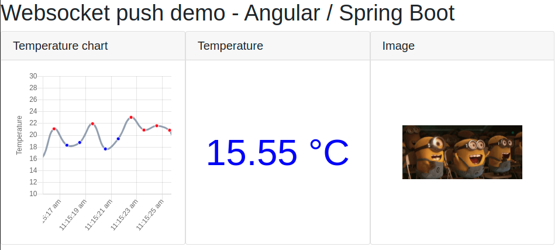

# Démo de "Server Push" par Websocket avec Spring-Boot et Angular



Petit exemple montrant la mise en place d'une poussée d'informations du serveur vers le client en utilisant les Websockets et la surcouche STOMP.
Dans cet exemple, 2 _topics_ sont ouverts sur le _endpoint_ _**/wsendpoint**_ pour envoyer des informations de manière "schedulée" :
- _**/temperature**_ sur lequel est envoyé un message JSON de température contenant un timestamp et une valeur. Ce topic est utilisé par 2 composants côté client : un pour suivre l'évoultion de la température sur un graphe, l'autre pour afficher la dernière température reçue.
- _**/image**_ sur lequel est envoyé une succession de contenu d'images (en Base64) pouvant notamment simulé un flux vidéo en temps réel (ce n'est pas un vrai streaming). Ce topic est utilisé par un composant côté client pour afficher cette succession d'images.

Le graphique est généré avec _Chart.js_ et son wrapper Angular _ng2-charts_, ainsi que le plugin _chartjs-plugin-streaming_ pour l'affichage en continu.

## Lancement

Soit vous pouvez lancer les différentes applications dans votre IDE ou utiliser la ligne de commande.

### Back :
Se déplacer dans le projet _**demo-websocket-back**_ el lancer l'application Spring-Boot _DemoWebSocketBackApplication_ avec Maven :
```shell
mvn spring-boot:run
```

### Front :
Se déplacer dans le projet _**demo-websocket-front**_ el lancer l'application Angular avec Angular CLI :
```shell
npm install
ng serve
```

Il ne reste plus qu'à lancer le client dans votre navigateur :
`http://localhost:4200/`
